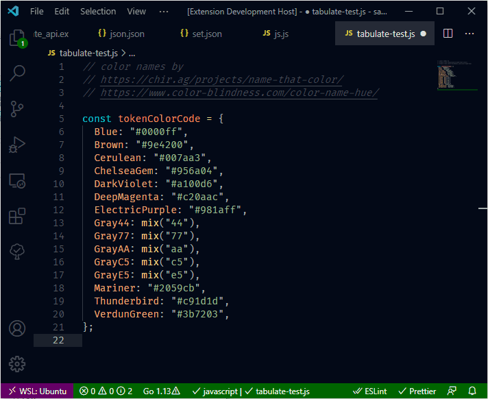
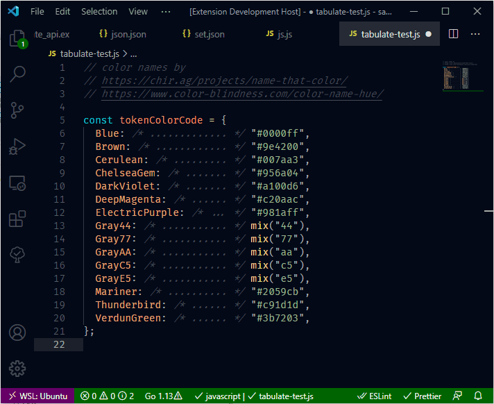
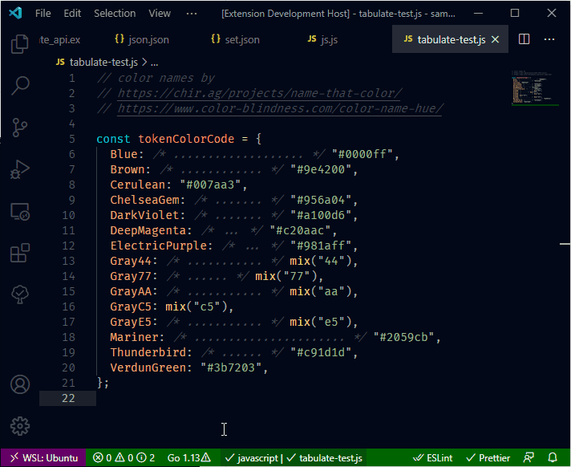

# [Tabulate](https://marketplace.visualstudio.com/items?itemName=a5hk.tabulate)

Tabulates Javascript objects. There are three commands `Tabulate`, `Un-Tabulate`, and `Re-Tabulate`.

## Tabulate

## Un-Tabulate

## Re-Tabulate

## License

[MIT License](LICENSE)
