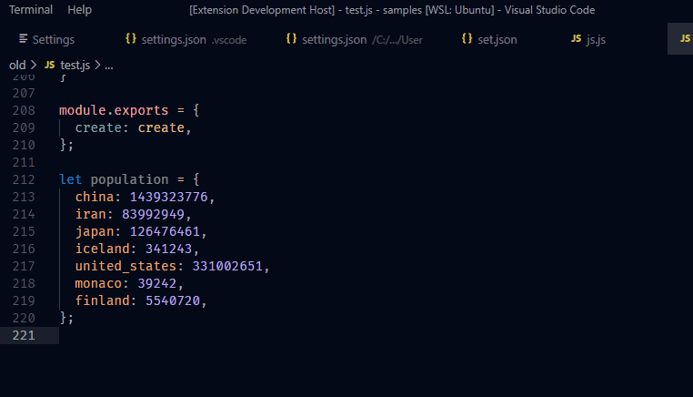

# [Tabulate](https://marketplace.visualstudio.com/items?itemName=a5hk.tabulate)

Tabulates Javascript objects. There are five commands `Tabulate`, `Tabulate Right`, `Un-Tabulate`, `Re-Tabulate` and `Re-Tabulate Right`.

## Tabulate

To left align values:

## Tabulate Right

To right align values:

## Un-Tabulate

## Re-Tabulate

## License

[MIT License](LICENSE)
